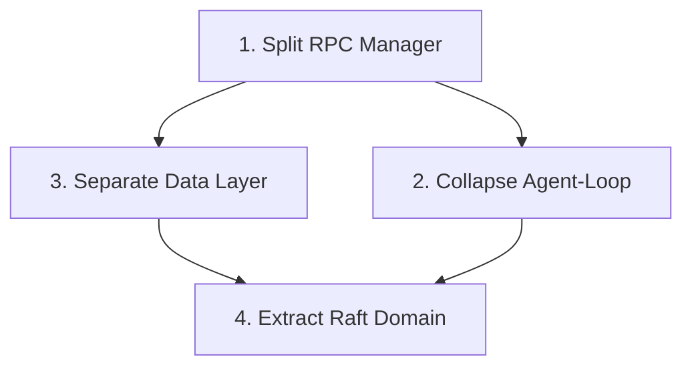

# Architecture Deepening — worksplice

**Status:** Draft  
**Date:** 2026-08-13  
**Based on:** architecture review `/tmp/architecture-review-1786629372.html`

## Summary

Four deepening opportunities identified. All approved for implementation. Ordered by dependency and leverage.

---

## 1. Split RPC Manager

**Goal:** Replace `lib/rpc-manager.ts` (1,307 lines, 11 exports) with four narrow modules.

**Before:**
- One module does registration, calling, subscribing, broadcasting, invoking.
- Interface is nearly as wide as implementation.
- Testing requires mocking the entire module.

**After:**
- `RpcRegistry` — register handlers
- `RpcCaller` — call RPC methods
- `RpcSubscriber` — subscribe/unsubscribe to events
- `RpcBroadcaster` — broadcast events to subscribers

**Interface change:** 11 exports → 4 modules, each with 2–3 methods.

**Acceptance:**
- All existing RPC functionality works
- Each new module has its own test file
- No functionality regression

**Files affected:** `lib/rpc-manager.ts`, `lib/rpc-manager.test.mjs`

---

## 2. Collapse Agent-Loop Orchestration

**Goal:** Consolidate `lib/agent-loop/` from 5 files into a single deep module.

**Before:**
- `loop.ts` (871 lines) pulls in `wake.ts`, `driver.ts`, `backfill.ts`, `reminder-cron.ts`
- Orchestration logic is scattered; dependencies leak across seam.

**After:**
- One `AgentLoop` module with interface: `start()`, `stop()`, `tick()`
- Internal orchestration hidden inside.
- Delete the four satellite files.

**Acceptance:**
- Agent loop behaviour unchanged
- `tick()` drives all sub-components internally
- Tests pass

**Files affected:** `lib/agent-loop/` (all 5 files)

---

## 3. Separate Data Layer from Business Logic

**Goal:** Define a `Store` interface; move SQLite to an adapter.

**Before:**
- `lib/data/db.ts` (1,186 lines) is a shallow facade — interface is the entire schema.
- raft modules and agent-loop import db.ts directly.

**After:**
- `Store` interface with ~50 method signatures (`lib/data/store.ts`).
- `SQLiteAdapter` implements `Store` (`lib/data/sqlite.ts`, was `lib/data/db.ts` / `RaftStore`).
- `lib/data/types.ts` holds the shared row/input types + search pure helpers.
- Business modules import `Store`, not `db.ts`.

**Acceptance:**
- All existing data access works ✅
- db.ts no longer exposed directly ✅ (deleted; consumers import types.ts / get Store via db-singleton)
- **Tests pass with either adapter — DEFERRED.** `InMemoryAdapter` 需忠实复刻事务回滚/外键/UNIQUE/消息不可变/FTS5 trigram/rowid/JOIN/ON CONFLICT 等 SQL 行为，等于重写微型关系引擎，且"内存语义与 SQLite 分叉"会破坏测试基准。经确认本期只做 Store 契约 + SQLiteAdapter；InMemoryAdapter 后续单独评估。

**Files affected:** `lib/data/db.ts`→`sqlite.ts`, `lib/data/store.ts` (new), `lib/data/types.ts` (new), raft/*, agent-loop/*, lib/types, components/*, app/api/tasks/*

---

## 4. Extract Raft Domain into a Proper Module

**Goal:** Consolidate `lib/raft/` (7 domain modules, 2,525 lines) into one indexed module.

**Before:**
- raft/ is a namespace, not a module.
- Each sub-domain (channels, members, messages, tasks, reminders) is imported separately.
- No single seam for testing.

**After:**
- One `domain/raft` module.
- Sub-domains are internal; only the index is exported.
- Imports reduce from 7 to 1 per consumer.

**Acceptance:**
- All raft functionality works
- Consumers import from one place
- Tests can mock the whole raft domain via one seam

**Files affected:** `lib/raft/*.ts`

---

## Dependency Graph

1 and 2 are independent and can be done in parallel. 4 depends on 3.

---

## Implementation Order

1. **Ticket A:** Split RPC Manager
2. **Ticket B:** Collapse Agent-Loop Orchestration
3. **Ticket C:** Separate Data Layer
4. **Ticket D:** Extract Raft Domain

Tickets A and B can be worked in any order. C blocks D.

---

## Success Criteria

- All tests pass after each ticket
- No regression in agent behaviour, RPC, or data access
- Each ticket reduces module size and interface width
- Codebase remains functional after each step
