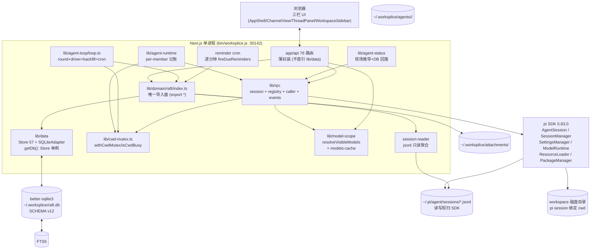

# 06-目标架构的分层与深模块切分

Type: grilling
Status: resolved
Blocked by: 01, 02, 04
Assignee: wayfinder-06

## Question

综合 01/02 研究与 04 边界决策，决策重构后的目标架构分层与深模块切分（`lib/` 域的依赖方向与导入面）。

- 分层：`lib/domain/raft`（唯一导入面 `lib/domain/raft/index.ts`）、`lib/data`（`Store` 契约 + `SQLiteAdapter`）、`lib/agent-loop`（深模块内 driver/wake/backfill/cron）、`lib/rpc` 新形态、`app/api` 薄封装的职责与依赖方向（是否延续 `Store` 契约、是否保留 `getDb(): Store` 单例）
- 深模块化：每个包的 entry point、子模块内部直引不经索引回环、测试 seam（raft 域 mock）如何保留
- 与 02 选型联动：若保留 better-sqlite3，Store 接口是否收窄/扩张；若换库，`lib/data` 的适配层形态
- 产出一张目标架构 Mermaid 图草稿与模块清单，为 spec §5 技术架构章提供骨架

## Answer

**决策总览（1 轮 grilling，6 问全 A，domain-modeling 同步落术语）**：

**Store 契约与单例（Q1+Q2）**：
- **保留 `Store` 57 方法宽总线，不拆窄接口**：`lib/data/store.ts:1-150` 57 方法 13 分组单体保留（02 选型「保留并收敛」延续），收敛仅体现在模块清单按分组罗列与命名，不改 `store.ts` 接口形状；拆为 `ChannelStore/MessageStore…` 窄接口无行为收益且破坏 `db-singleton` 热重载守卫。
- **保留 `getDb(): Store` 单例 + 版本守卫**：`lib/data/db-singleton.ts:17-24` `globalThis.__workspliceDb + __workspliceDbOpenedVersion !== SCHEMA_VERSION` 重建保留，测试经 `globalThis.__workspliceDb = openDataDb(tmp)` 直连覆盖，不引入 DI 容器；与 ADR-0006 单事务幂等不变式同纪律。

**唯一导入面与依赖方向（Q6）**：
- **固化 `lib/domain/raft/index.ts: export *` 单口为 raft 域唯一对外导入面**：`app/api/*` 与 `lib/agent-loop` 只 `from "@/lib/domain/raft"` 单条 import，域内子模块（channels/members/messages/tasks/inbox/wake/reactions/pinned/attachments/search/reminders/observability/recurrence）互相经相对路径直引不经索引回环；测试 seam `mock 整个 raft 域` 保留（`lib/domain/raft/index.ts` 唯一 seam）。
- **依赖方向单向固化**：`lib/data (Store/SQLiteAdapter/schema/db-singleton/dirs)` ← `lib/domain/raft` ← `lib/rpc + lib/agent-loop + lib/cwd-mutex + lib/model-scope` ← `app/api (薄封装)`；`app/api` 禁止直引 `lib/data`，`lib/cwd-mutex` 为横切深模块被 `lib/agent-runtime` 与 `lib/agent-loop/driver` 共用。

**lib/rpc 新形态（Q3）**：
- **冻结四件套**：`session.ts`（薄 Wrapper，仅 `promptRunning` + 薄订阅转发，不复刻 `isStreaming/isCompacting`）+ `registry.ts`（per-member `__workspliceSessions` 记账，不按 cwd 猜归属）+ `caller.ts`（`createAgentSessionServices→resolveVisibleModels→createAgentSessionFromServices` 二段式，`trustReloadOptions/withExtensionTools`）+ `events.ts`（`subscriber+broadcaster` 合并窄面）；`withCwdStartLock/trackStarting` 已迁 `lib/cwd-mutex.ts`，`lib/rpc/index.ts` 11 导出保持，`SDK SessionManager.listAll` 不替代 registry（SDK 无 BusyCwd）。

**lib/cwd-mutex 独立深模块（Q4）**：
- **独立 `lib/cwd-mutex.ts` 深模块**：窄接口 `withCwdMutex(cwd, fn) + isCwdBusy(cwd) + findBusySession(cwd)`（`realpathSync` 归一 + `Map<realpath,count>` 计数器 + `waitForSettle(SETTLE_EVENTS)` + `BUSY_CWD_RETRY_DELAY_MS=250`）为 `lib/agent-runtime`（`hasBusyRpcSessionForCwd` 编排）与 `lib/agent-loop/driver`（hint 合并 busy 重试）共用唯一串行事实来源；`globalThis.__workspliceCwdStartLocks/__workspliceStartingSessionCwds` 热重载守卫保留。

**lib/agent-loop 深模块（Q5）**：
- **保持单文件深模块**：`lib/agent-loop/loop.ts` 内聚 round+driver+backfill+cron 四段（~1442 行），`lib/agent-loop/index.ts` 仅 re-export `createAgentLoop` 窄出口，不拆 `driver.ts/backfill.ts/cron.ts` 子文件；`globalThis.__workspliceWakeListeners` 热重载守卫与 `MUST_RESPOND_CAP=2` / error-silent 分级（ADR-0005）同此纪律保留。

**模块清单（目标架构 7 域 22 文件，零 schema 影响）**：

| 层 | 模块 | 文件 | 职责 | 入口 |
|---|---|---|---|---|
| data | lib/data | `store.ts` (57 方法 13 分组) / `sqlite.ts` (`SQLiteAdapter implements Store`) / `schema.ts` (SCHEMA_VERSION 12) / `db-singleton.ts` (`getDb(): Store`) / `dirs.ts` | Store 契约 + SQLite 存储 + 单例守卫 | `getDb()` 单例 |
| domain | lib/domain/raft | `index.ts` (唯一导入面) + `channels.ts/members.ts/messages.ts/tasks.ts/inbox.ts/wake.ts/reactions.ts/pinned.ts/attachments.ts/search.ts/reminders.ts/observability.ts/recurrence.ts/reads.ts` 13 子域 | raft 全域（`UNIQUE(target_id,seq)`+freshness-hold+mute/inbox/wake） | `lib/domain/raft` 单口 |
| mutex | lib/cwd-mutex | `cwd-mutex.ts` | Cwd 串行互斥窄接口 | `withCwdMutex/isCwdBusy` |
| rpc | lib/rpc | `session.ts` / `registry.ts` / `caller.ts` / `events.ts` + `index.ts` | per-member 记账 + 二段式工厂 + 薄 Wrapper | `lib/rpc` 11 导出 |
| loop | lib/agent-loop | `loop.ts` (round+driver+backfill+cron) + `index.ts` | 驱动层自研循环 + reminder cron | `createAgentLoop()` |
| scope | lib/model-scope | `model-scope.ts` (`resolveVisibleModels` @71) + `models-cache.ts` + `startup-preferences.ts` + `tool-presets.ts` | SDK 模型域 thin adapter | `resolveVisibleModels` |
| trust | lib/project-trust等 | `project-trust.ts` / `provider-listing.ts` / `session-reader.ts` / `agent-runtime.ts` / `agent-status.ts` / `agent-lifecycle.ts` | 编排与状态点/生命周期 | 各自窄口 |
| api | app/api | 76 路由薄封装（`channels/members/messages/tasks/inbox/reminders/search/reactions/pinned/attachments` + `models/auth/plugins/skills/agent`） | HTTP 薄封装，直接调 `lib/domain/raft` 或 `lib/rpc`，不直引 `lib/data` | `POST /api/messages` 等 |

**目标架构 Mermaid 图草稿（for spec-rebuild.md §5）**：

**术语与 ADR（domain-modeling）**：
- `CONTEXT.md` 新增 **深模块 (Deep Module)** 与 **唯一导入面 (Single Entry)** 两条（已落盘，109→120 行）。
- 新增 **ADR-0008 `目标架构的分层与深模块切分`**（`docs/adr/0008-target-architecture-deep-modules.md`，含分层依赖图 + 四件套冻结 + Store 宽总线保留）。

**对后续票据输入**：
- 09 spec 形态：`spec-rebuild.md §5 技术架构` 直接引用本 Mermaid 图与模块清单，深模块切分按 `lib/cwd-mutex → lib/rpc → lib/agent-loop` 三步排期，每步验收 `tsc --noEmit + lint + npm test (347 用例)`，零 schema 影响。
- 07 UI：B·Guided Journey 首版不拆 `ChannelView`，A 二期拆 `Discuss/Track/Review` 三视图时复用本架构的深模块纪律（`lib/panel-state.ts` 单槽 + 唯一导入面）。
- 08 迁移：本架构零数据迁移，仅 `round_logs` 三列增量已在 ADR-0006 覆盖，`lib/data` 5 文件不变。

> Grilling 1 轮 6 问全 A；`domain-modeling` 同步落 `CONTEXT.md` 与 ADR-0008。

