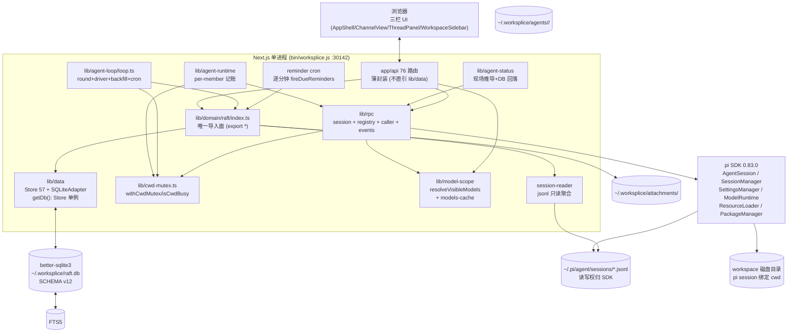

# worksplice pi SDK 重构 spec（技术）

> 状态：**草稿（2026-08-20，ticket 09 已决，按段待确认）** — 本稿由 wayfinder effort `pi-sdk-rebuild` 地图闭合产出（9 票全决），按 `ADR-0009` 五段式骨架撰写；`docs/spec.md`（2026-08-03 已确认，8 章产品 spec）保持锁定不变，本文件为独立技术重构 spec。确认流程：人类按五段逐段放行，全部放行后标 **已确认** 并另起 effort 执行迁移（Plan, don't do）。
> 正文简体中文，标识符英文；标注 **[已决]** 引已确认票据，标注 **[待确认]** 为本稿写作对后续实现的新提议（需在确认阶段逐段放行）。
> 术语以 `CONTEXT.md` 为准（成员/agent/家目录/项目目录/工作区/会话文件/频道/唤醒/轮次/深模块/唯一导入面/SDK 委托边界/薄 Wrapper/Cwd 互斥/成本看板），新增术语经 `domain-modeling` 落 `CONTEXT.md`（本次无新增）。

## 已决索引

| 决策 | 出处 | 一句话 | ADR |
|---|---|---|---|
| pi SDK 能力边界 | 01 | 可委托 tools/enabledModels/SessionManager/SettingsManager 等 6 类，不可委托 registry/per-member 记账/BusyCwd/双轨状态/raft 全域 | — |
| 数据层保留 Store 57 | 02 | better-sqlite3 + Store 57 方法宽总线保留，零换库，SCHEMA 11 链无破坏 | ADR-0006 前置 |
| 库存量扫描 | 03 | lib/rpc 1479 / agent-loop 1442 / raft 2626 / data 1813 行，3 热重载守卫，76 路由 4968 行，ChannelView 11 概念/屏 | — |
| SDK 委托边界 | 04 | lib/rpc 保留 4 件套（session+registry+caller+events），model-scope thin adapter，models.json/skills/plugins 委托 SDK，手术短期保留 | ADR-0007 |
| agent-loop 重塑 | 05 | 重试 2/3/3→1/1/2，默认 revise→resend，抽 lib/cwd-mutex，round_logs 增 3 列，双视图成本看板 | ADR-0005 |
| 目标架构七域 22 文件 | 06 | 分层单向固化，Store 宽总线与 getDb 单例保留，唯一导入面，Mermaid 全图 | ADR-0008 |
| UI B·Guided Journey | 07 | 11→≤4 概念/屏，旅程条 4 步 + 强空状态 + ···收敛，秘书五步流为首访入口，A 为二期 | — |
| 单向前兼容 v12 三列 | 08 | v1..v11→v12 一键升，三件套文件覆写回滚，单事务幂等，固化门禁保留 | ADR-0006 |
| spec 形态与排期 | 09 | 独立 docs/spec-rebuild.md，五段式，混合切分，硬门禁+4 项手动，5 条验收，按段确认 | ADR-0009 |

---

## 1. 现状盘点

**[已决]** 基线固化于 `research/03` 491 行 E01-E69（ticket 03），后续章节直接引用行号，不重述。

- **规模**：`lib/rpc 1479`（session/registry/caller/subscriber/broadcaster + 3 globalThis 守卫）/ `lib/agent-loop 1442`（round+driver+backfill+cron 单文件深模块）/ `lib/domain/raft 2626`（13 子域）/ `lib/data 1813`（Store 57 + SQLiteAdapter + schema 16 语句 + FTS5 trigram 5 triggers）/ `app/api 76 路由 4968 行` 薄封装；`ChannelView.tsx 3117` 单组件 11 概念/屏为 UI 主战场（07）。
- **依赖与纪律**：`Store` 契约 `lib/data/store.ts:1-150` 57 方法 13 分组宽总线（02 选型保留不拆）；`lib/domain/raft/index.ts: export *` 唯一导入面（06）；`getDb(): Store` 单例 `lib/data/db-singleton.ts:17-24` + `__workspliceDbOpenedVersion !== SCHEMA_VERSION` 版本守卫；`lib/cwd-mutex.ts` 待抽但已在 05 决为窄接口。
- **数据**：`SCHEMA_VERSION 11` 14 表 + 5 triggers，4 个 `PRAGMA table_info` 迁移函数幂等；`~/.worksplice/raft.db` + `attachments/` + `agents/<slug>-<id8>/MEMORY.md` 三件套文件面（08）。
- **稳定性痛点**：token 主源 `deliverWithFreshness` 2/3/3 重试 + 大 prompt；可靠性 `busy-cwd` 双层 + backfill 归属；可观测性 `round_logs` 无 cost 列（05）。

> 详见 `research/03-current-state-inventory.md` 与 `lib/rpc/* / lib/agent-loop/loop.ts / lib/data/schema.ts` 行号索引；本章不新增事实。

## 2. 目标架构

**[已决]** 分层单向固化与 7 域 22 文件模块清单已由 ticket 06 与 `ADR-0008` 冻结，本章直接引用，不回溯。

**依赖方向**：`lib/data (Store/SQLiteAdapter/schema/db-singleton/dirs)` ← `lib/domain/raft (唯一导入面)` ← `lib/rpc + lib/agent-loop + lib/cwd-mutex + lib/model-scope` ← `app/api (薄封装)`；`app/api` 禁止直引 `lib/data`；`lib/cwd-mutex` 为横切深模块被 `lib/agent-runtime` 与 `driver` 共用。

**Mermaid 全图**（见附录 A，源自 06 Answer）：`Browser ↔ Routes → Facade → Data ↔ DB ↔ FTS`，`Loop/Cron2 → Facade`，`Rpc → SDK → SESS/WS`，`Runtime/Loop/Rpc → Mutex` 等 12 条边完整表。

**模块清单**（7 域 22 文件，零 schema 影响）：

| 层 | 模块 | 文件 | 职责 | 入口 |
|---|---|---|---|---|
| data | lib/data | `store.ts` (57) / `sqlite.ts` / `schema.ts` (v12) / `db-singleton.ts` / `dirs.ts` | Store + SQLite + 单例守卫 | `getDb(): Store` |
| domain | lib/domain/raft | `index.ts` 单口 + 13 子域 `channels/members/messages/tasks/inbox/wake/reactions/pinned/attachments/search/reminders/observability/recurrence/reads` | raft 全域（UNIQUE+hold+mute/inbox/wake） | `lib/domain/raft` 单口 |
| mutex | lib/cwd-mutex | `cwd-mutex.ts` | `withCwdMutex/isCwdBusy/findBusySession` | `withCwdMutex` |
| rpc | lib/rpc | `session.ts` / `registry.ts` / `caller.ts` / `events.ts` + `index.ts` | per-member 记账 + 二段式工厂 + 薄 Wrapper | `lib/rpc` 11 导出 |
| loop | lib/agent-loop | `loop.ts` (round+driver+backfill+cron) + `index.ts` | 自研驱动 + cron | `createAgentLoop()` |
| scope | lib/model-scope | `model-scope.ts:71` + `models-cache.ts` + `startup-preferences.ts` + `tool-presets.ts` | SDK thin adapter | `resolveVisibleModels` |
| api | app/api | 76 路由薄封装 | HTTP 薄封装 | `POST /api/messages` 等 |

> 深模块/唯一导入面定义见 `CONTEXT.md`；`Store` 宽总线保留与 `lib/domain/raft/index.ts` 单口纪律见 `ADR-0008 §决策`；`SDK 委托边界/薄 Wrapper` 见 `ADR-0007`。

## 3. 分步迁移

**[已决]** 切分维度为 **主轴按深模块、横切按稳定性/兼容验收**（09 Q3），`SCHEMA_VERSION 12` 仅 `round_logs` 三列增量、分期仅为排期、`runMigrations()` 每次全量单事务幂等（08 不变式）。

| 期 | 深模块 | 交付物 | 关键改动（已决行号） | 验收（硬门禁 + 手动） |
|---|---|---|---|---|
| 1 | `lib/cwd-mutex.ts` 独立 | 窄接口 `withCwdMutex/isCwdBusy/findBusySession` + `realpathSync` 单测 | 从 `lib/rpc/registry.ts` 与 `lib/agent-loop/driver` 抽取 `withCwdStartLock/trackStarting/waitForSettle`，`globalThis.__workspliceCwdStartLocks/__workspliceStartingSessionCwds` 守卫保留（05/06） | `tsc+lint+test 347` 全绿；① 共享 project 目录并发串行探活 |
| 2 | `lib/rpc` 新形态 + model-scope | `session+registry+caller+events` 四件套 + `model-scope.ts:71` thin adapter + `tool-presets` 去硬编码 | `session.ts` 仅 `promptRunning` + 薄订阅，`registry` per-member 记账不按 cwd 猜，`caller` 二段式 `trustReloadOptions/withExtensionTools`，`models.json` 走 `SettingsManager.withLock`，手术 `disable-model-invocation` 短期保留（04, ADR-0007） | 全绿；② 固化门禁 `chooseSessionFileForStart` 无回归 |
| 3 | `lib/agent-loop` 重塑 + 成本看板 | 重试收敛 + prompt 截断 + `round_logs` 三列 + 双视图 | `MAX_REVISE 2→1 / MAX_RESEND 3→1 / MAX_TASK_STATUS 3→2`，默认 `revise→resend`，`MESSAGE_CONTENT_CAP 4000 + 最近 20 条 + task preview 120`，`migrateRoundLogsCostColumns()` 幂等 ALTER（05/06, ADR-0005/0006） | 全绿；③ `round_logs.prompt_tokens/cost` 在可观测页 badge 非空，双视图 `docs/cost-monitoring-baseline.md` 滑动验证；④ 热重载三守卫重启后无旧闭包 |
| 4（随 3 验证） | UI B·Guided Journey 首版（不拆 ChannelView） | 旅程条 4 步 + 强空状态 + `···` 收敛 + 秘书入口 | `ChannelView 11→≤4 概念/屏`，保留三栏骨架与 76 路由薄封装，仅加旅程条/空状态/折叠（07）；A `Discuss/Track/Review` 深拆为二期方向，不进本期 | 全绿；⑤ `prototype-ui/index.html?variant=b` 可点通 `describe→hand off→let it run→review`，秘书五步流首访闭环 |

> 每期不引入 DI 容器、窄接口拆分或 `drizzle-kit/prisma migrate`；`lib/data` 5 文件扁平保留，深模块切分零 schema 影响（06）。

## 4. 兼容清单

**[已决]** 单向前兼容 + 三件套文件覆写回滚（08, ADR-0006），本章为清单化重述，不新增承诺。

- **承诺**：存量 `~/.worksplice/raft.db` 任一历史版本 v1..v11 一键升至 v12+（`SCHEMA_STATEMENTS IF NOT EXISTS` + `PRAGMA table_info` 列检测幂等 `migrateRoundLogsCostColumns`）；不支持 `user_version` 自动 down。
- **迁移不变式**：`runMigrations()` 保持 `db.transaction(() => { trigram → 16 语句 → 4 检测 ALTER → seed → pragma })` 单事务全量执行，每次启动全量跑；`SCHEMA_VERSION` 严格 `+1` 单调递增，不压缩、不重编号。
- **版本落点**：`SCHEMA_VERSION 12` 仅 `round_logs` 新增 `prompt_tokens INTEGER / completion_tokens INTEGER / cost REAL`（05 成本看板），`SCHEMA_STATEMENTS 16 语句` 与 FTS5 5 triggers + seed 不动（08 §版本落点）。
- **热重载与单例**：`getDb(): Store` 单例 + `__workspliceDbOpenedVersion !== SCHEMA_VERSION` 重建双保留（`lib/data/db-singleton.ts:17-24`），`Store 57` 宽总线暂不拆。
- **会话文件门禁**：`固化 / 无主文件永不解析 / backfill 归属门禁 / 跨作者内容去重` 四术语原定义保留（`CONTEXT.md:28-40`，ADR-0003/0004），校验在 `lib/agent-runtime.ts:62-130` 与 `lib/agent-loop/loop.ts:1031-1082`，不移入 SDK；备份清单不含 `~/.pi/agent/sessions/*.jsonl`（读写权归 SDK、app 只读）。
- **文件面**：`attachments/` 随机文件名与 `agents/<slug>-<id8>/MEMORY.md` 六段大纲不入 `runMigrations`，仅入三件套备份 `raft.db + attachments/ + agents/`（`lib/data/dirs.ts:22-29`）。

## 5. 成本基线

**[已决]** 沿用 `docs/cost-monitoring-baseline.md` 双视图（05），本章为口径冻结，不新增采集。

- **口径**：全量 session 聚合 + 最近 50 轮滑动（`lib/session-stats.ts` 只读聚合 + `round_logs` 三列落盘，SDK 可取则写否则 null）；`cost-monitoring-baseline.md` 已含 BAI-5 实测 3 agent token/cost 基线。
- **节流**：`deliverWithFreshness` 重试收敛 50%（revise 2→1 / resend 3→1 / task status 3→2），默认 `revise→resend`（held 后原样重试一次、耗尽 silent）；`MUST_RESPOND_CAP=2` 与 `error/silent` 分级不变；`BUSY_CWD_RETRY_DELAY_MS=250` 防热自旋。
- **可观测**：`round_logs` 环形 cap 200/agent，`isAbandonedRound + reason` 原文 badge，`must-respond capped` 单独解释；`error/busy-cwd` 轮为排查入口（`docs/engineering-standards.md §3`）。

## 6. 验收标准

**[待确认]** 本章为 09 新增、类 `docs/spec.md §8` 的 5 条客观可测标准，为独立 effort 的合闸条件（09 Q6）。

1. **行号可追溯**：所有架构与兼容结论均可点到 `research/01-03 + 04-08 Answer 行号 + ADR-0005~0009`，无孤证（`file:line` 证据索引完备）。
2. **全量门禁全绿**：`npm run typecheck`（`tsc --noEmit`）+ `npm run lint` + `npm test`（全量 347 用例）全绿，绝不 `next build`（`docs/engineering-standards.md §2.2`）。
3. **图表零漂移**：`spec-rebuild.md` Mermaid 全图与 7域22文件模块清单与 `ADR-0008` / `06 Answer` 一致，无字段漂移。
4. **兼容可回滚**：存量 `~/.worksplice/raft.db v11 → v12` 单事务幂等一键升 + 三件套文件覆写回滚可演示（`runMigrations` 单事务不变式，`getDb()` 版本守卫）。
5. **旅程可演示**：`prototype-ui/index.html?variant=b` B·Guided Journey 首版可点通 `describe → hand off → let it run → review`，秘书五步流首访闭环可演示（07）。

> 确认流程：人类按 §1–§6 逐段放行，全部放行后本文件头部标 **已确认（日期，ticket 09）**，随后另起 effort 按 §3 四期执行（Plan, don't do 边界不越线）。

---

## 附录

### A. 目标架构 Mermaid 全图

> 源自 `06 Answer` Mermaid 草稿，`ADR-0008` 已立。

### B. 模块清单（7 域 22 文件）

| 层 | 模块 | 文件 | 职责 | 入口 |
|---|---|---|---|---|
| data | lib/data | `store.ts` (57 方法 13 分组) / `sqlite.ts` (`SQLiteAdapter implements Store`) / `schema.ts` (SCHEMA_VERSION 12) / `db-singleton.ts` (`getDb(): Store`) / `dirs.ts` | Store 契约 + SQLite 存储 + 单例守卫 | `getDb()` 单例 |
| domain | lib/domain/raft | `index.ts` (唯一导入面) + 13 子域 `channels.ts/members.ts/messages.ts/tasks.ts/inbox.ts/wake.ts/reactions.ts/pinned.ts/attachments.ts/search.ts/reminders.ts/observability.ts/recurrence.ts/reads.ts` | raft 全域（UNIQUE+hold+mute/inbox/wake） | `lib/domain/raft` 单口 |
| mutex | lib/cwd-mutex | `cwd-mutex.ts` | Cwd 串行互斥窄接口 | `withCwdMutex/isCwdBusy` |
| rpc | lib/rpc | `session.ts` / `registry.ts` / `caller.ts` / `events.ts` + `index.ts` | per-member 记账 + 二段式工厂 + 薄 Wrapper | `lib/rpc` 11 导出 |
| loop | lib/agent-loop | `loop.ts` (round+driver+backfill+cron) + `index.ts` | 驱动层自研循环 + reminder cron | `createAgentLoop()` |
| scope | lib/model-scope | `model-scope.ts:71` + `models-cache.ts` + `startup-preferences.ts` + `tool-presets.ts` | SDK 模型域 thin adapter | `resolveVisibleModels` |
| trust | lib/project-trust等 | `project-trust.ts` / `provider-listing.ts` / `session-reader.ts` / `agent-runtime.ts` / `agent-status.ts` / `agent-lifecycle.ts` | 编排与状态点/生命周期 | 各自窄口 |
| api | app/api | 76 路由薄封装 | HTTP 薄封装 | `POST /api/messages` 等 |

### C. ADR 索引

| ADR | 标题 | 对应票据 |
|---|---|---|
| 0001 | agent 家目录与共享项目目录两分（ADR-0001） | — |
| 0002 | 任务板拖拽即状态转移（ADR-0002） | — |
| 0003 | 会话文件固化归属（ADR-0003） | — |
| 0004 | backfill 归属门禁（ADR-0004） | — |
| 0005 | agent-loop 重塑：成本/可靠性/可观测性 | 05 |
| 0006 | 向后兼容与数据迁移策略 | 08 |
| 0007 | SDK 委托边界：lib/rpc 与 model/skills/extensions 收敛 | 04 |
| 0008 | 目标架构的分层与深模块切分 | 06 |
| 0009 | spec 形态：独立 docs/spec-rebuild.md 与五段式排期 | 09 |

### D. 术语增量

本次无新增 glossary（09 Q7 已决）。`CONTEXT.md` 已含 SDK 委托边界/薄 Wrapper（04）/ 深模块/唯一导入面（06）/ Cwd 互斥/成本看板（05）6 条增量共 117 行，后续新增经 `domain-modeling` 落 `CONTEXT.md`。

### E. 原型与交付物链接

- UI 原型：`.scratch/pi-sdk-rebuild/prototype-ui/index.html?variant=b`（B·Guided Journey 首版，`?variant=a|c` 对比，零后端，详见 07 Answer）
- 库存量扫描：`.scratch/pi-sdk-rebuild/research/03` E01-E69
- 能力边界证据：`.scratch/pi-sdk-rebuild/research/01` §1-2

---

> 本 spec 经确认后，执行 effort 按 §3 四期切 ticket（tracker 原生 blocking 生 frontier 视图），每期验收见上表；执行本身不在本 wayfinder 地图内（Plan, don't do）。
