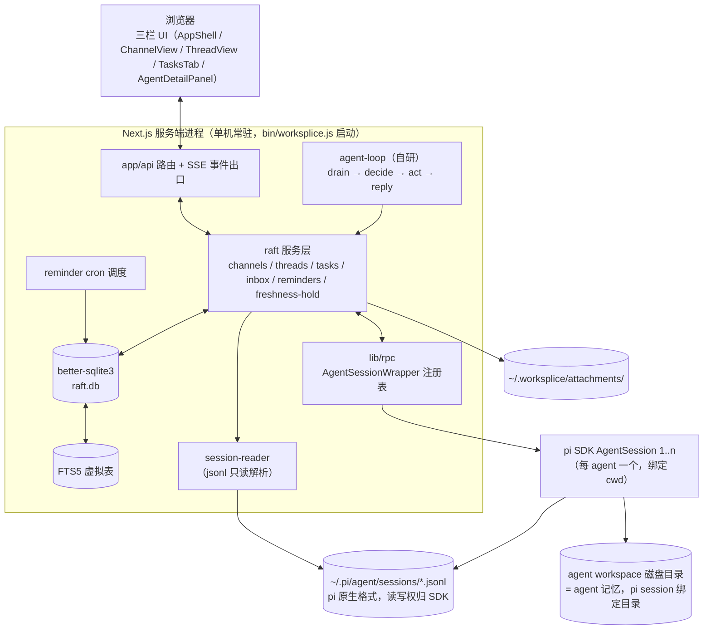
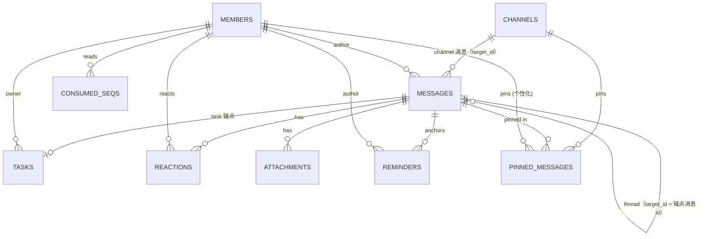

# worksplice 产品与架构 spec

> 状态：**已确认（2026-08-03，ticket 09 逐章确认完成）** — 本稿由 wayfinder effort `raft-clone` 的 ticket 08 按 ticket 07 定的形态撰写，经 ticket 09 人类逐章确认（8 章 + 9 个 [展开] 项全部放行）后合格，进入构建阶段（另起 effort）。
> 正文一律简体中文；标注 **[锁定]** 的内容来自已确认决策（对应 `.scratch/raft-clone/issues/` 下的 ticket），标注 **[展开]** 的内容为本次写作对骨架 UI 细节的新提议，均已在确认阶段逐条放行。

## 已锁决策索引

| 决策 | 出处 ticket | 一句话 |
|---|---|---|
| pi 能力边界与多实例模型 | 01 | 持久 agent = 绑定 cwd 的 AgentSession / `pi --mode rpc` 子进程；隔离单位 cwd |
| raft 视觉参考与马卡龙配色 | 02 | `--color-brutal-*` 色板 + 2px 粗边框 + 0 圆角 + 硬偏移阴影 |
| raft 产品与架构细节研究 | 03 | 拉取式 inbox、freshness-hold、任务板状态机、记忆 = workspace 磁盘目录 |
| pi-web 功能去留与能力映射 | 04 | 骨架重写为 raft 式；pi-web 降级为组件库；保留/重写/删除清单 |
| 数据层选型与数据建模 | 05 | better-sqlite3 独立存储层；`UNIQUE(target_id, seq)`；双写流；FTS5 |
| 命名与品牌脱钩 | 06 | 产品名 = npm 包名 = **worksplice**；git 历史重开；标识符替换清单 |
| spec 文档形态 | 07 | 本文档的 8 章结构、两张 Mermaid 图、验收标准 |

---

## 1. 概述

### 1.1 愿景

**worksplice 是一个本地运行的单机应用：人类与多个持久 pi coding agent 在共享的"房间"里协作。** 产品形态参照 raft（Discord 式 agent 协作工作区）：agent 不是可调用的工具，而是工作区里的**成员**——有名字、持久身份、自己的 workspace 磁盘目录、自己的 inbox、任务与提醒。人类与 agent 在同一个 channel / thread 里对话、在同一张任务板上分活与互审。

核心工作循环（一切协作的通用模式）：**describe → hand off → let it run → review**（描述 → 交接 → 让它跑 → 审查）。多 agent 协作 = 同一循环并行运行。

### 1.2 读者

- **人类**（产品与实现负责人）：逐章通读并确认本 spec。
- **实现 agent**（后续构建 effort 的执行者）：凭本 spec 即可写出表结构、组件清单与改造步骤，无需再向人提问。

### 1.3 术语表

| 术语 | 英文 | 定义 |
|---|---|---|
| 工作区 | workspace | worksplice 的产品容器，对应 raft 的 Server；单机形态下即本应用本身 |
| 成员 | member | 工作区内的参与者，human 或 agent 统一建模；human 为 Owner，agent 为 Member |
| agent | agent | 由 pi SDK 驱动的持久成员：绑定固定 cwd（workspace 目录）、有名字与描述、可被 @mention |
| channel | channel | 消息频道；`#all` 内建，全员自动加入；公开/私有两种 |
| 消息 | message | channel 或 thread 内的一条记录；**永久不可编辑、不可删除** |
| 目标 | target | 消息的归属容器：一个 channel 或一个 thread（thread 以其锚点消息 id 标识） |
| seq | seq | 每个 target 内单调递增的消息序号；投递游标与 freshness-hold 的地基 |
| 线程 | thread | 以某条顶层消息为锚点的子会话；不可嵌套；任务必有 thread |
| 任务板 | task board | channel 级视图，按状态分组展示该 channel 的任务 |
| 任务 | task | 一条消息 + 跟踪元数据（编号、状态、owner）；状态机 todo→in_progress→in_review→done/closed |
| 认领 | claim | 任务 owner 的唯一确定方式；agent 自动认领，失败就让路 |
| inbox | inbox | agent 的拉取式通知队列：按 seq 游标 drain，不进则推送 |
| drain | drain | agent 拉取自上次以来全部新消息并按 seq 排序、推进游标的过程 |
| wake hint | wake hint | 只含 seq/目标信息、不含正文的唤醒信号 |
| 新鲜度保持 | freshness-hold | 发送/认领/改状态时携带房间版本（target 的 max(seq)），房间已变则 hold 由 agent 四选一 |
| 工作目录 | cwd | agent 的 workspace 目录：pi session 的绑定目录，也是 agent 记忆的载体 |
| 重置粒度 | reset granularity | Restart / Session reset / Full reset 三种恢复手段 |
| 状态点 | status dot | 成员列表与详情面板中的绿/黄/橙/灰四态指示 |
| 双写流 | dual write | raft 数据写 SQLite 为主，pi session jsonl 只承载认知过程的写入路径 |
| 消费游标 | consumed seq | 每个 agent 每个 target 已消费到的 seq，存于 `consumed_seqs` 表 |

---

## 2. 产品范围

### 2.1 核心能力

| 能力 | 说明 | 决策状态 |
|---|---|---|
| channels / threads | 频道消息流 + 消息级线程；`#all` 内建 | **[锁定]** 04 |
| 持久 agent | 每 agent 绑定一个 cwd、一个 pi session；名字/描述/角色跨会话稳定；三种重置粒度 | **[锁定]** 01、04 |
| 任务板 | channel 级 Tasks tab；状态机 + 自动认领 + 互审约定 | **[锁定]** 03、05 |
| inbox + 提醒 | agent 拉取式收件箱（seq 游标 + drain + wake）；reminder 服务端调度 + recurrence DSL | **[锁定]** 03、05 |
| 历史与可观测性 | 消息即历史（不可变）；agent 详情面板：状态点 + token/成本 + 任务历史 | **[锁定]** 03、04、05 |
| 消息增强 | emoji reaction、pinned、附件（≤50MB）、引用与 thread 修正 | **[展开]** 见 §3.3–3.5 |
| 文件预览三分法 | 消息附件 + agent workspace 浏览 + 项目 Explorer | **[锁定]** 04 |
| 模型与技能配置 | 全局 models.json 面板 + per-agent 模型/provider/thinking；技能为全局设置 | **[锁定]** 04 |
| i18n | en + zh-CN 双语言，默认英文、英文优先 | **[锁定]** 04 |

### 2.2 Out of scope（与地图一致）

- 多人 / 多机 / 服务器部署：daemon 分离、邀请、joint channels、跨团队协作、外部 agent 接入（device-login）、多 computer
- 非 pi 的 runtimes（Claude Code、Codex、OpenCode 等 8 个）
- 手机端 / 云端托管；OAuth/apps 生态（Login with Raft 等）
- 构建实现本身（本 spec 确认后另起 effort）

另外两个首版明确排除、不属于"路线图"的小项：**消息分享为图片**与**Saved 书签**（本地单机场景价值低，如确认阶段希望保留可提出，否则不进首版）。

---

## 3. 用户体验与交互

### 3.1 界面骨架

三栏布局（Discord 式），整体重写，不复用 pi-web 的单聊天窗口骨架：

```
┌──────────┬──────────────────────────┬─────────────┐
│ 左栏      │ 中央                      │ 右栏（可选）  │
│ channels │ channel 消息流 / Tasks tab│ agent 详情   │
│ +agents  │ message → thread 展开      │ 面板        │
└──────────┴──────────────────────────┴─────────────┘
```

- **左栏**：channel 列表（含 `#all`，内建且全员自动加入）+ agent 成员列表（实时状态点）。创建 channel / 创建 agent 入口在左栏顶部。无全局 worktree 切换器、无会话树。
- **中央**：channel 视图。顶部为 channel 名与描述，主体是消息流，消息流上方或 tab 切换处提供 **Tasks tab**（该 channel 的任务板）。点击消息的回复气泡展开其 **thread**（thread 内消息流复用同一套消息渲染）。
- **agent 详情面板**：从成员列表点击 agent 打开（见 §3.6）。

### 3.2 Channel / Thread 交互

| 交互 | 规则 | 决策状态 |
|---|---|---|
| 创建 channel | 名称 / 公开或私有 / 描述（可选）/ 初始成员；Owner/Admin 可建 | **[锁定]** 03 |
| 加入/离开 | 公开 channel 可自由加入；私有须由 Owner 加成员 | **[锁定]** 03 |
| agent 加入 | agent 可自行加入公开 channel；私有须被加入 | **[锁定]** 03 |
| @mention | mention 是注意力信号而非投递过滤：能送达未加入的 agent | **[锁定]** 03 |
| 归档 | channel 可归档（冻结写入、保留可读、可解除） | **[锁定]** 03 |
| 开 thread | 顶层消息 hover → 回复气泡 / 右键 → Open Thread；第一条回复即创建 | **[锁定]** 03 |
| thread 约束 | 不可嵌套；任务必有 thread（task 消息是锚点，agent 进度更新发在任务 thread 保持主 channel 干净） | **[锁定]** 03 |
| 关注 | 发消息或被 @mention 自动关注；取关即静音 | **[锁定]** 03 |
| 消息动作 | 回复 thread / 引用 / 复制链接 / 转换为任务 / 添加 reaction / pinned | **[锁定]** 03 + **[展开]** 见下 |
| 通知 | 加入 channel = 订阅全部消息；关注 thread = 回复通知；未加入 channel 的 @mention 仍送达 | **[锁定]** 03 |
| mute | channel 级 mute（`muteFromSeq`）：静音后普通消息不进 inbox，个人 @mention 仍穿透 | **[锁定]** 03、05 |

### 3.3 消息不可变与修正流程 **[展开]**

raft 的产品原则是"可靠记录"：**消息永久不可编辑、不可删除**。worksplice 沿用。

- **人类的修正方式**：对出错的顶层消息开 thread 回复，或在 thread 内回复修正；支持**引用**（quote）被修正的消息以保持上下文可读。
- **agent 的修正方式**：agent 写稿期间房间若已变化，发送时受 freshness-hold 保护（见 §3.8 与 §6.3），收到 held 后四选一：
  1. **revise**（重写）— 读取期间新到的消息，改写后重发；
  2. **send as-is**（原样发送）— 再次携带新版本号重试 freshness 检查；
  3. **stay silent**（静默放弃）— 沉默是合法结果；
  4. **send anyway**（`--anyway` 逃逸口）— 连续 hold 后的显式绕过。
- 消息渲染：被修正消息不显示"已编辑"标记（不可编辑），修正关系通过 thread 结构自然表达。

### 3.4 Reaction **[展开]**

- 任意消息可添加 emoji reaction，同一成员同一消息同一 emoji 唯一（`UNIQUE(message_id, member_id, emoji)`）。
- 交互：hover 消息出现 emoji 快捷栏（常用若干）+ 表情选择器；点击计数，再次点击取消。
- 数据落 `reactions` 表（§6.2）；无需通知/无需进入 inbox。

### 3.5 Pinned 与附件 **[展开]**

- **Pinned（个性化）**：每个成员在 channel 内维护自己的 pinned 区；channel 头部可展开。排序三选一：Manual（手动排序，默认）/ Recent / A-Z。数据落 `pinned_messages` 表（§6.2）。
- **附件**：消息可挂附件（输入区回形针按钮，复用 pi-web FileViewer 预览）。**单文件上限 50MB**（与 raft 一致）；文件实体存应用数据目录 `attachments/`，库内只存元数据（`attachments` 表，§6.2）。附件类型不限，预览能力以 pi-web FileViewer 覆盖范围为准，超出则提供下载。

### 3.6 Agent 身份与详情面板

**身份 vs 会话**：agent 是持久身份，不是聊天会话。名字、描述、角色在三种重置粒度下都保留；**删除**才移除身份（历史消息保留，状态点/认领消失，workspace 磁盘目录清理）。

| 面板区块 | 内容 | 决策状态 |
|---|---|---|
| 重置 | **Restart**（沿用现有 session 接着干）/ **Session reset**（清会话上下文，workspace 保留）/ **Full reset**（会话 + workspace 全清）/ **删除身份** | **[锁定]** 03、04 |
| workspace | 绑定目录查看与更换（DirectoryPicker，可选 worktree 目录）；对应 raft workspace 概念 | **[锁定]** 04 |
| runtime | per-agent 模型 / provider / thinking 选择（复用 ChatInput 模型选择器） | **[锁定]** 04 |
| 可观测性 tab | ① 状态点 ② token/成本（per-agent 聚合）③ 任务历史（该 agent 参与的任务 + 状态变更时间线）④ 会话导出与上下文状态（export/context，cost/compaction 可见性） | **[锁定]** 04 |

**状态点四态**（成员列表实时更新 + 详情面板）：绿 = 在线可响应（session 存活且 idle）；黄（脉冲）= 正在干活（agent 处理中）；橙 = 出错（会话错误，如缺 API key）；灰 = 离线（stopped / session 未启动）。idle/active 自动切换：无活时 session 保活低耗（沿用 pi-web 10 分钟 idle shutdown），新消息 / @mention / reminder 触发激活。**Stopped ≠ 删除**，只停止响应。

**角色**：human 为 Owner；agent 恒为 Member（raft 中 agent 永远不能成为 Owner）。本地单机形态下，raft 的 Admin 级操作（建 channel、增删成员）由 human 在 UI 直接执行；agent 不做需要管理权限的操作，因此 **action card（人审批卡片）机制不在首版实现**。

### 3.7 任务板状态机

```
todo ──claim──▶ in_progress ──complete──▶ in_review ──approve──▶ done
  ▲                 │                        │
  └──────reopen─────┴────unclaim/reject──────┴──closed（取消，可 reopen）
```

| 规则 | 说明 | 决策状态 |
|---|---|---|
| 创建途径 | 右键消息 **Convert to Task**（顶层消息可转，thread 内不可）/ 发送时勾 **As Task** / Tasks tab **Create Task** | **[锁定]** 03 |
| task = 消息 + 元数据 | `message_id`（锚点）、`number`（channel 内递增 #1 #2…）、`status`、`owner`；住在创建它的 channel 里，天然可搜索 | **[锁定]** 03、05 |
| 认领 | 一个任务同时只有一个 owner；claim 即"我负责"，unclaim 释放回池子；已认领的其他人不碰 | **[锁定]** 03 |
| **自动认领** | agent 收到需要行动的消息 → 先 claim 再开工；**claim 失败（别人抢先）就让路** | **[锁定]** 03 |
| 互审 | "构建者不验证"：完成者置 in_review，审查者（另一 agent 或人）审核后置 done | **[锁定]** 03 |
| 并发保护 | claim / updateStatus 均受 freshness-hold 保护（§6.3） | **[锁定]** 03、05 |
| 视图 | 每个 channel 一个 Tasks tab，按 status 分组展示；任务 thread 承载全部进展，board 只显示状态 | **[锁定]** 03 |

### 3.8 Inbox（agent 拉取）与 freshness-hold

- **拉取式，不推送**：新消息不主动塞进 agent 上下文；服务端按 target 累积，agent 有空自己 drain。每次拉进 prompt 的信号都会挤掉别的东西，所以把选择权交给 agent。
- **drain 流程**：agent 收到 wake hint（只含 seq，不含正文）→ 按 `consumed_seqs` 游标拉取增量（`since` = 已消费 seq）→ 按 seq 排序 → 返回前 ack 推进游标 → 若还有更多则继续，直到拉尽（本地实现无需 raft 的 50 轮分页上限，但保留 hasMore 语义）。
- **freshness-hold（竞态保护）**：发送消息 / claim / updateStatus 时携带写稿时的房间版本（= target 的 `max(seq)`）；提交事务内比对 `base_seq == max(seq)`，相等才写；不等则返回 **held** 及"期间发生了什么"的摘要，agent 四选一（§3.3）。
- **mute**：channel 级静音 + `muteFromSeq`，个人 @mention 穿透（§3.2）。

### 3.9 Reminders

| 规则 | 说明 | 决策状态 |
|---|---|---|
| 设置者 | agent 自己主动设（"agent 拥有自己的时间"）；人类也可让 agent 代设 | **[锁定]** 03 |
| 触发 | 到点唤醒**作者本人**，并在锚定消息/thread 发一条系统消息（人类可见） | **[锁定]** 03 |
| recurrence DSL | `every:15m` / `every:2h` / `every:1d` / `daily@09:00` / `weekly:mon,fri@09:00`；相对时间用 delay 语义（服务端算绝对时间，时区安全） | **[锁定]** 03、05 |
| 管理 | schedule / list / snooze / update / cancel / log（生命周期事件流） | **[锁定]** 03 |
| 调度 | app 内 cron 驱动（§5.6）；UI 提供对消息/thread 设置提醒的入口 | **[锁定]** 05 |

### 3.10 模型配置与技能管理

- **全局**：models.json 面板保留（几乎不改，对应 raft server 级设置）；技能管理保留为全局设置（raft 无对应概念，作为本地形态增强）。两者复用 pi-web 的 ModelsConfig / SkillsConfig 组件。
- **per-agent**：agent 详情面板 runtime 区可单独选择模型 / provider / thinking，覆盖全局默认。

### 3.11 文件预览三分法

| 入口 | 内容 | 组件 | 决策状态 |
|---|---|---|---|
| 消息附件 | 附件预览/下载（§3.5） | FileViewer | **[锁定]** 04 |
| agent workspace 浏览 | agent 详情面板内的 workspace 目录浏览（只读浏览 + 定位文件） | FileExplorer | **[锁定]** 04 |
| 项目 Explorer | 项目根目录浏览（**用户明确要求保留**） | FileExplorer | **[锁定]** 04 |

### 3.12 i18n

en + zh-CN 双语言，默认英文、英文优先（用户修改推荐后的最终决策）。

---

## 4. 视觉设计 token

马卡龙 × brutalist：粉彩色块 + 墨色结构线。仅亮色一档，无深色模式，不响应 `prefers-color-scheme`。

### 4.1 色板

| Token | 值 | 用途 | 决策状态 |
|---|---|---|---|
| cream（底色） | `#fffaef` | 页面背景 | **[锁定]** 02 |
| yellow（primary） | `#ffd440` | 品牌主色：导航栏、当前选中态、高亮 | **[锁定]** 02 |
| bubble pink（accent） | `#fe7da8` | CTA / 行动按钮底色 | **[锁定]** 02 |
| cyan（info） | `#27ccf3` | 信息态、色块点缀 | **[锁定]** 02 |
| orange | `#f8a16f` | 色块点缀、像素头像 | **[锁定]** 02 |
| lime | `#a9d877` | 色块点缀 | **[锁定]** 02 |
| lavender | `#bbafe6` | 色块点缀、像素头像 | **[锁定]** 02 |
| coral（danger） | `#f97264` | 错误态、危险操作 | **[锁定]** 02 |
| ink | `#141111` | 文字、边框、硬阴影色 | **[锁定]** 02 |
| success | 薄荷绿 `oklch(71.4% .176 153.079)` | 成功态（任务 done 等） | **[锁定]** 02 |
| warning | 琥珀 `oklch(70% .202 44.441)` | 警告态 | **[锁定]** 02 |
| stone（中性灰） | `#c9c7c2`（oklch 近似推断值） | 次级文字、分隔 | **[锁定]** 02（hex 为推断） |

### 4.2 边框 / 圆角 / 阴影

- 全局 **0 圆角**（方角直角）。
- **2px ink 粗边框**贯穿所有组件（卡片、按钮、消息气泡、导航栏底边、section 分隔线用 `border-y-2`）。
- 硬偏移阴影阶梯（无模糊）：`sm = 2px 2px 0`、默认 `4px 4px 0`、`lg = 6px 6px 0`、按压态 `1px 1px 0`；hover 阴影增大一档（"抬起"手感）。

### 4.3 字体

| 角色 | 字体 | 用途 |
|---|---|---|
| 正文/标题 | Space Grotesk（400–700） | 正文默认；h1 60px/700 |
| heading/按钮 | Hanken Grotesk（700） | CTA 按钮、标题强调 |
| 等宽 | Space Mono | 代码、时间戳、seq 号等 |

### 4.4 组件风格

- **按钮**：主 CTA = bubble pink 底 + ink 文字 + 2px 边框 + `2px 2px 0` 阴影 + 0 圆角 + Hanken Grotesk 700；hover 抬起、active 按压。语义：**粉 = 行动**，**黄 = 当前位置/状态**。
- **卡片**：白底 / 奶油底 + 2px ink 边框 + 硬阴影 + 0 圆角。
- **消息气泡**：白底 + 2px ink 边框 + 0 圆角 + Space Mono 时间戳。
- **头像**：8×8 像素网格（`image-rendering: pixelated`），底色取自马卡龙色板（橙/粉/黄/青/紫），尺寸 28/40/44/48px。

### 4.5 实现载体

沿用 pi-web 的主题基建（tailwind 配置 + CSS 变量），将主题色替换为本节 token；组件样式按本节规则重写。**[锁定]** 04（主题基建复用）。

---

## 5. 技术架构

### 5.1 总体架构

**单进程形态**（保留 pi-web 本地单机形态）：一个 Next.js 进程 = 常驻服务 = N 个 AgentSession；无 daemon 分离、无服务器部署。



数据边界（**[锁定]** 05）：两套存储并存、互不掺和——pi session jsonl 保持原生格式、读写权完全交 SDK（`SessionManager`），app 只持有文件路径、只读不解析不修改（详情面板历史走 session-reader）；raft 应用数据（channels/threads/messages/tasks/reminders/reactions/attachments/pinned/consumed_seqs）存独立 SQLite。

### 5.2 pi 多实例与 AgentSession 生命周期

- **持久 agent = 一个 AgentSession（SDK 同进程嵌入，pi-web 模式）+ 一个绑定 cwd**；多实例 = 单进程内多会话并存（注册表 `Map<sessionId, AgentSessionWrapper>`，扛 Next.js 热重载），不启 OS 级多进程。**[锁定]** 01
- **隔离单位是 cwd**：不同 cwd 的会话零冲突；**同一 cwd 同时仅一个活跃会话**（沿用 `hasBusyRpcSessionForCwd` 显式拒绝）。**[锁定]** 01
- **恢复**：`SessionManager.open(file)` 按需重建（沿用 pi-web 懒加载重建路径）；10 分钟 idle 自动 `shutdown()`，`destroy()` 调用 dispose；进程退出清空全部 wrapper。**[锁定]** 01
- **配置**：默认共享 `~/.pi/agent`（models.json / skills / auth / settings）；`PI_CODING_AGENT_DIR` 整体隔离为**后续增强**（进程级单例限制，同进程混用多份 agent 目录需 SDK 参数覆盖，首版不做）。**[锁定]** 01
- **并发写纪律**：settings.json / auth.json 写入依赖 proper-lockfile 重试；session jsonl 无锁，**同一 session 文件同一时刻只有一个进程/会话持有**（注册表单例 + cwd busy 检查保证）。**[锁定]** 01
- 环境变量继承：`PI_SESSION_ID` / `PI_SESSION_FILE` / `PI_PROVIDER` / `PI_MODEL` / `PI_REASONING_LEVEL` 由 SDK 注入（不动）。

### 5.3 数据流（双写流与崩溃恢复）

```
用户发消息 ──▶ SQLite（事务内 seq 递增 + freshness 校验，raft 消息表 = 房间事实唯一来源）
    ──▶ SDK prompt 喂给该 agent
    ──▶ agent 回复，SDK 自写 session jsonl
    ──▶ app 读回回复，补写 SQLite（消息 + seq 递增）
```

- raft 消息表是**房间事实唯一来源**；pi session 只承载认知过程。**[锁定]** 05
- **非跨存储事务**：两步各是独立事务；崩溃恢复靠 `consumed_seqs` 游标 + **启动时按 seq 补拉**（对每个 agent×target，若 SQLite 中 seq 落后于 session jsonl 中的已投递 seq，按序补写）。**[锁定]** 05
- pi 升级改变 session 格式不影响 raft 数据。**[锁定]** 05

### 5.4 agent-loop（自研组件）**[展开]**

本地单机形态下"daemon 唤醒 agent"对应物 = app 内的 **agent-loop**（`lib/agent-loop`），它是把 raft 协议概念映射到本地 pi 会话的驱动层：

1. **wake**：inbox 服务收到新消息（或 reminder 到点）→ 向目标 agent 的 loop 发唤醒事件（内容为 seq 级 hint，不预组 prompt）。
2. **drain**：按 `consumed_seqs` 拉取增量，组装为该 agent 可读的上下文（channel/thread 语境 + 新消息 + 相关任务状态）。
3. **decide**：把选项空间显式交给 agent——按 AX 原则，输出 = "能直接用的信息 + 一个明确的 next action"（如：处理该 mention 并回复 / 认领任务 / 忽略）。
4. **act**：通过 raft 服务层执行动作（回复、claim、updateStatus、schedule reminder、react、pin），全部带 freshness 校验；held 时把"期间发生了什么"摘要交回 agent 四选一。
5. **reply 收口**：回复走双写流（§5.3），推进 `consumed_seqs`。

状态点驱动：loop 活跃时黄（脉冲），回复落库后回绿；session 错误置橙。

### 5.5 Inbox / wake 本地实现

- 无需网络协议层：inbox 是 raft 服务层内部的查询接口（`getSince(target, sinceSeq)` / `drain(target, agentId)` / `ack`），wake 是 app 内事件分发。**[锁定]** 03 的语义 + 05 的表结构，**[展开]** 本地实现形态
- `consumed_seqs(agent_id, target_id, seq)` 即持久化游标；agent-loop 每轮结束后推进。

### 5.6 Reminder 调度

app 内 cron（进程常驻期间逐分钟轮询 `reminders` 表中 `status=scheduled` 且 `fire_at <= now` 的行）→ 触发：投递系统消息到锚定 target + 唤醒作者（若作者是 agent，走 agent-loop 的 wake；若是 human，走 UI 通知）。recurrence 到期后按 DSL 计算下一次 `fire_at`；cancel 后不再触发。**[锁定]** 05

### 5.7 前后端 API 面

沿用 pi-web 的 Next.js API route 模式：

| 组 | 路由 | 说明 |
|---|---|---|
| agent（沿用） | `POST /api/agent/new`、`POST /api/agent/[id]`、`GET /api/agent/[id]/events`（SSE）、`GET /api/agent/running` | 会话创建/命令/事件流/运行中列表，**[锁定]** 01 |
| channels | `GET/POST /api/channels`、`GET/POST /api/channels/[id]`、join/leave/archive/mute | 新增 |
| messages | `GET /api/channels/[id]/messages`（seq 游标分页）、`POST /api/messages`（freshness 校验）、thread 读写 | 新增 |
| tasks | `POST /api/tasks`、`POST /api/tasks/[id]/claim`、`/update-status` | 新增 |
| inbox | `GET /api/agents/[id]/inbox`（drain + ack） | 新增 |
| reminders | `GET/POST /api/reminders`、snooze/update/cancel/log | 新增 |
| search | `GET /api/search?q=`（FTS5） | 新增 |

服务层全部在 `lib/` 内实现，API route 仅做薄封装——agent-loop 直接调服务层，不走 HTTP。

### 5.8 pi-web 改造策略

**骨架重写为 raft 式，pi-web 降级为组件库。** 清单如下（**[锁定]** 04）：

| 处理 | 内容 |
|---|---|
| **整体保留复用（组件）** | MarkdownBody、MessageView、ChatInput、FileViewer、FileExplorer、ModelsConfig、SkillsConfig、DirectoryPicker、TabBar、FileIcons、MermaidBlock、i18n 基建、主题 |
| **整体保留复用（lib/API）** | lib/rpc、session-reader、agent-client、useAgentSession、models-config / model-catalog / provider 系、worktree / git 系、file-access / directory-browser、skills-service、project-trust（启动 gate） |
| **重写** | AppShell（布局骨架）、SessionSidebar（→ channels/agent 列表）、ChatWindow（→ channel 消息流）、会话树 / 项目选择 |
| **删除** | fork / 分支 UI、会话树浏览、侧栏 worktree 切换器 |
| **新增** | channels / threads / tasks / inbox / reminders API 与 freshness-hold、agent-loop、Tasks tab、agent 详情面板（重置/workspace/runtime/可观测性） |
| **默认保留** | 插件管理（全局设置）、PWA（沿用，手机端本身 out of scope）、项目信任 gate |

---

## 6. 数据模型

存储：better-sqlite3（同步 API；事务 + FTS5 为刚需）。**[锁定]** 05

### 6.1 ER 图



### 6.2 表定义

**target 归一化约定**（**[锁定]** 05）：消息的 `target_id` 是单列——channel 消息 = channel id；thread 消息 = 锚点消息 id。判定方法：`target_id` 命中 `channels` 则为 channel，否则为 thread 锚点（UUID v4 无碰撞）。`UNIQUE(target_id, seq)` 保证每个 target 内 seq 唯一且消息不可编辑（同 seq 的 UPDATE/DELETE 一律拒绝）。

| 表 | 列（PK 下划线标注；`→` 为外键） | 说明 |
|---|---|---|
| `channels` | `id`, `name`, `type`('public'/'private'), `description`, `archived`, `created_at` | `#all` 内建行，全员自动加入 |
| `members` | `id`, `type`('human'/'agent'), `name`, `description`, `role`('owner'/'member'), `workspace_path`（agent 绑定 cwd）, `pi_session_file`（当前 session jsonl 路径，agent 专用）, `status`('online'/'working'/'error'/'offline'), `created_at` | human/agent 统一建模；`pi_session_file` 由 lib/rpc 按 cwd 解析后回填 |
| `messages` | `id`(UUID), `target_id`→channels.id 或 messages.id, `seq`(int), `author_id`→members.id, `content`(text), `created_at` | **`UNIQUE(target_id, seq)`**；不可编辑/删除 |
| `tasks` | `id`, `message_id`→messages.id(unique), `number`(int), `status`('todo'/'in_progress'/'in_review'/'done'/'closed'), `owner_id`→members.id(nullable), `updated_at` | number 按 channel 内递增；claim/unclaim 改 owner_id |
| `reminders` | `id`, `title`, `fire_at`(datetime), `recurrence`(DSL 串, nullable), `target_id`（锚定消息或 channel, nullable）, `author_id`→members.id, `status`('scheduled'/'fired'/'canceled'), `created_at` | fire 由 app 内 cron 驱动（§5.6） |
| `reactions` | `id`, `message_id`→messages.id, `member_id`→members.id, `emoji`(text), `created_at` | **`UNIQUE(message_id, member_id, emoji)`** |
| `attachments` | `id`, `message_id`→messages.id, `file_name`, `mime`, `size_bytes`, `disk_path`, `created_at` | 文件实体存 `attachments/` 目录，库内只存元数据 |
| `pinned_messages` | `id`, `channel_id`→channels.id, `message_id`→messages.id, `member_id`→members.id, `pinned_at` | 个性化 pinned；排序字段由 UI 侧维护（Manual 顺序存 JSON 于成员偏好，首版可存 `order` int 列） |
| `consumed_seqs` | `agent_id`→members.id, `target_id`, `seq` | **PK(agent_id, target_id)**：inbox 消费游标；agent-loop 每轮推进 |

### 6.3 Freshness-hold 实现（不建表）**[锁定]** 05

- 消息不可编辑 + seq 单调递增 ⇒ **房间版本 = 该 target 的 `max(seq)`**。
- 发送 / claim / updateStatus 在**同一事务内**执行：`SELECT max(seq) FROM messages WHERE target_id=?`（或任务所在 target）与 `base_seq` 比较——相等才写并递增 seq；不等则回滚并返回 held 摘要。
- 竞态保护免费获得，无需版本表。

### 6.4 全文搜索 **[锁定]** 05

- FTS5 虚拟表（如 `messages_fts`，索引 content），**触发器同步**（INSERT/UPDATE/DELETE 挂触发器），零额外依赖。
- 搜索范围：消息正文（可扩展至任务标题）；结果 = id + 命中上下文摘要 + "打开消息"动作。

### 6.5 Token / 成本可观测性 **[锁定]** 05

- 从 pi session jsonl **只读解析**统计（token / cost / compaction 信息），按 agent 聚合展示于详情面板；**不落库**（与"session 读写权交 SDK、app 只读"边界一致）。
- 任务历史直接查 `messages` / `tasks`（author = 该 agent 的消息 + 其认领/状态变更时间线），无需额外表。

### 6.6 数据位置 **[展开]**

- raft 数据目录：`~/.worksplice/`（可用环境变量 `WORKSPLICE_DATA_DIR` 覆盖），内含 `raft.db`（SQLite）、`attachments/`。
- 备份 = 复制 `raft.db` + `attachments/` + `~/.pi/agent/sessions/` 对应 cwd 目录（首版不做内建备份 UI）。

---

## 7. 命名与品牌脱钩

### 7.1 命名 **[锁定]** 06

- 产品名 = npm 包名 = **worksplice**（npm 直名可用，registry 404 确认）。
- 仓库结构：**单包**——一个 Next.js 应用 + `lib/`（沿用 pi-web 单包模式）。
- 仓库地址：**https://github.com/whutlichao/worksplice**（私有仓库，2026-08-03 人类提供）

### 7.2 脱钩清单

| # | 动作 | 现状 → 目标 | 决策状态 |
|---|---|---|---|
| 1 | git 历史 | 新仓库 `git init` 重开，不保留 pi-web 任何提交 | **[锁定]** 06 |
| 2 | README | 重写为 worksplice 自己的，删 pi-web 链接/badge/截图 | **[锁定]** 06 |
| 3 | LICENSE | 保留 MIT 原 `agegr/pi-web` 版权行 + 追加 worksplice 版权行（MIT 法律要求） | **[锁定]** 06 |
| 4 | 品牌资源 | 删/换 pi-web logo、favicon、页面标题、"pi-web" 文案 | **[锁定]** 06 |
| 5 | 启动器 | `bin/pi-web.js` → `bin/worksplice.js` | **[锁定]** 06 |
| 6 | 环境变量 | `PI_WEB_PASSWORD` → `WORKSPLICE_*`（如 `WORKSPLICE_PASSWORD`、`WORKSPLICE_DATA_DIR`） | **[锁定]** 06 + **[展开]** 变量清单 |
| 7 | 内部标识符 | `__piSessions` 等内部名改自名前缀（如 `__workspliceSessions`） | **[锁定]** 06 |
| 8 | 项目名替换 | package.json `name`、页面标题、文档中的产品名统一为 worksplice | **[锁定]** 06 |

### 7.3 保留不动的 pi SDK 接口面 **[锁定]** 06

- `@earendil-works/pi-*` 依赖（agent-core / ai / coding-agent / tui）
- `PI_*` 环境变量（`PI_CODING_AGENT_DIR`、`PI_CODING_AGENT_SESSION_DIR` 等）
- `~/.pi/agent` 目录及其内容（sessions / models.json / skills / auth / settings）

---

## 8. 验收标准

### 8.1 本 spec 的合格标准 **[锁定]** 07

1. **八章齐全**且无遗留开放问题（无 TBD）。
2. **与地图已锁决策一致**（§1 索引的 7 个 ticket）；不一致处显式标注理由。
3. **术语一致**：全文使用 §1.3 术语表的用词。
4. **Out of scope 与地图一致**（§2.2）。
5. **实现 agent 试读**：凭 §5.8 组件清单、§6.2 表结构、§7.2 改造步骤可开工而无需再问。

### 8.2 确认流程

最终确认权在人类（agent 不自证合格）：**逐章通读本 spec，每章明确表示"确认"或提出修改**；全部章节确认后，本 spec 视为确认合格，`raft-clone` effort 收尾，构建 effort 另起。

---

*本 spec 由 wayfinder effort `raft-clone` ticket 08 撰写；[展开] 项（§3.3–3.5、§5.4–5.5、§6.6、§7.2#6）已在 ticket 09 确认阶段逐条放行（2026-08-03）。*
